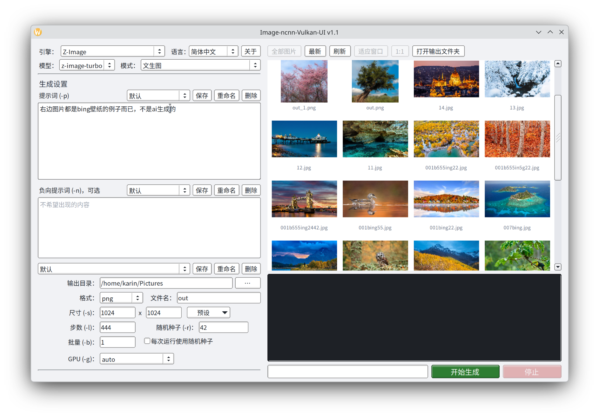

# Image-ncnn-Vulkan-UI

一个给 [`qwenimage-ncnn-vulkan`](https://github.com/nihui/qwenimage-ncnn-vulkan)（Qwen-Image-2.1）
和 [`zimage-ncnn-vulkan`](https://github.com/nihui/zimage-ncnn-vulkan)（Z-Image）用的简单图形界面程序，使用了FLTK。




> **关于仓库名**：本仓库起初只打算给 `qwenimage-ncnn-vulkan` 做个界面，因此叫
> `Qwen-Image-ncnn-Vulkan-test`。后来因为自己的使用需求，又加上了
> `zimage-ncnn-vulkan` 的支持，程序也随之改名为 `Image-ncnn-Vulkan-UI`。
> 但仓库没有改动。

> **声明**：本项目完全由 AI 生成，也无意作为长期维护的项目，因此 Issues
> 可能永远不会处理，或者处理得很慢。如果真的有我之外的人在用这个软件，并且遇到问题，建议直接自己改
> ——源码不长，编译也就一条命令。

## 使用方法

下载Releases二进制文件，放到与qwenimage-ncnn-vulkan或qwenimage-ncnn-vulkan可执行二进制相同目录，然后运行即可。

## 目录布局

程序名与模型路径都是固定的，全部取自本程序所在目录，界面上不提供修改：

```
Image-ncnn-Vulkan-UI           <- 本程序
qwenimage-ncnn-vulkan          <- Qwen-Image-2.1 生成程序（可选）
zimage-ncnn-vulkan             <- Z-Image 生成程序（可选）
models/
├── qwenimage21/               <- Qwen-Image-2.1 模型
└── z-image-ncnn/
    ├── z-image-turbo/         <- Z-Image 主模型
    ├── z-image-control/       <- ControlNet 模型
    └── z-image-control-tile/  <- Tile ControlNet 模型
```

Z-Image 的模型文件夹也可以直接放在程序目录下（即 `z-image-turbo/` 与生成程序同级）。

## 运行环境

- Linux 桌面，X11 或 Wayland 均可
- FLTK 1.4（必需；1.3 不行——Wayland 后端从 1.4 才开始提供）
- libpng（可选）：装上后带透明通道的 PNG 预览才正确

## 编译

Kubuntu / Ubuntu：

```bash
sudo apt install build-essential cmake libfltk1.4-dev libpng-dev
./build.sh
```

或者手动：

```bash
cmake -S . -B build -DCMAKE_BUILD_TYPE=Release
cmake --build build -j$(nproc)
```

产物为 `build/Image-ncnn-Vulkan-UI`，放进上面的目录里运行即可。

FLTK 装在非默认位置（例如家目录下的自编译版本）时，用 `FLTK_DIR` 指向存放
`FLTKConfig.cmake` 的目录：

```bash
FLTK_DIR=/path/to/fltk/share/fltk ./build.sh
```

## 关于

项目主页：<https://github.com/xixiaoguo/Qwen-Image-ncnn-Vulkan-test>

界面右上角的「关于」按钮会用系统浏览器打开它。
